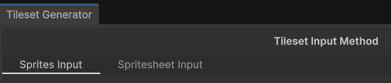
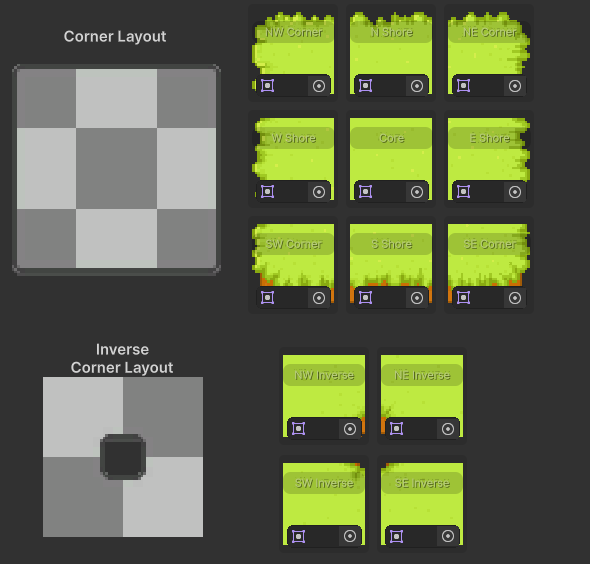
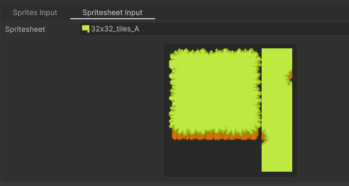

Tileset Generator
================

Create 2D 47-tile tilesets and rule tiles from a set of sprites or spritesheet directly in Unity.

How it works
-------------
1. Given a valid input, `Tileset Generator` uses fast GPU-based pixel copying to generate tilesets.
2. The generated tilesets are then used to create a [Rule Tile](https://docs.unity3d.com/Packages/com.unity.2d.tilemap.extras@7.0/manual/RuleTile.html) asset.

`Tileset Generator` provides two ways to generate tilesets 
- Sprites Input
- Spritesheet Input

You can select either of the two ways to generate tilesets by clicking on the tabs at the top of the window.

Sprites Input
-------------
In this mode, you can assign a set of sprites to generate a tileset.
The sprites should be assigned to the fields below the tab and correspond to the example layout displayed on the left:

Spritesheet Input
-------------
In this mode only a single texture is required. However, the texture ***has to have power of two*** dimensions (eg. 128x128) and the following layout:

